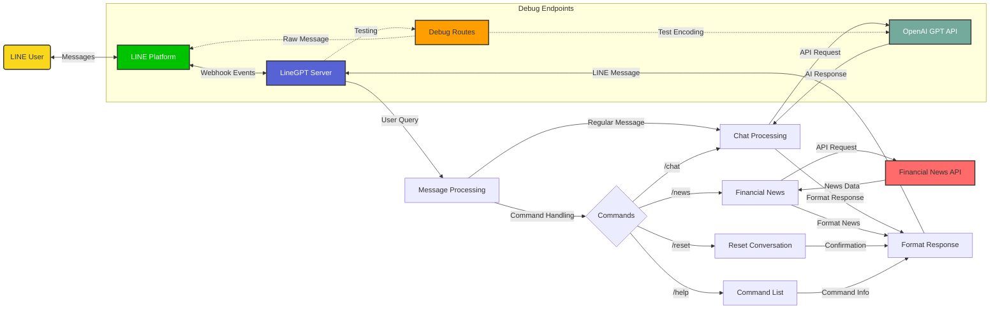
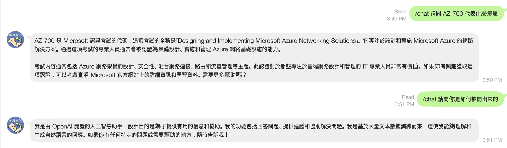
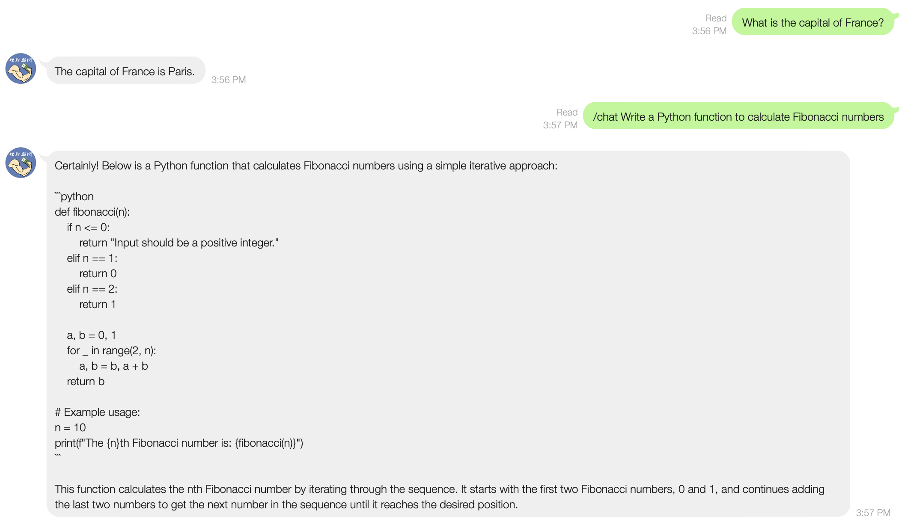

# LineGPT - ChatGPT Integration for LINE

This bot integrates ChatGPT with LINE messaging platform, allowing users to interact with ChatGPT through LINE messages.

## Features

- Chat with ChatGPT through LINE messages
- Support for conversation history
- Easy setup and deployment
- Configurable ChatGPT parameters
- Daily financial news updates
- Command system for different interactions

## 🔄 LineGPT Workflow

The following diagram illustrates the architecture and data flow of the LineGPT application:



This diagram shows how user messages flow through the LINE platform to the LineGPT server, where they are processed based on command type, then routed to appropriate services (OpenAI API or Financial News API), and finally formatted and sent back to the user through LINE.

## Testing Results





### Example Test Commands

Here are some examples of how to test your LineGPT setup:

```bash
# Test sending a simple message to a user
curl "http://localhost:5000/test_message?user_id=USER_ID_HERE&message=Hello from LineGPT!"

# Test sending Chinese and other non-ASCII messages
curl "http://localhost:5000/test_chinese?user_id=USER_ID_HERE"

# Test sending a message to all registered users
curl "http://localhost:5000/test_broadcast?message=Hello everyone from LineGPT!"

# Test encoding with specific text
curl "http://localhost:5000/test_encoding?user_id=USER_ID_HERE&text=测试中文消息"
```

Replace `USER_ID_HERE` with your actual LINE user ID, which you can obtain from the `/get_user_id` endpoint.

## What You Can Ask GPT

With LineGPT, you can ask GPT about virtually anything, including:

- General knowledge questions
- Help with writing or composing messages
- Explanation of complex concepts
- Financial advice and market insights
- Programming help and code examples
- Language translations
- Creative writing prompts
- Math problems and calculations
- Historical information
- Current events (up to its knowledge cutoff)
- Recommendations for books, movies, etc.

Simply start your message with a question or statement, or use the `/chat` command followed by your query.

### Example Interactions

Here are some examples of how you can interact with GPT through LINE:

#### General Questions
```
You: What is the capital of France?
GPT: The capital of France is Paris.
```

#### Language Translation
```
You: /chat Translate "Hello, how are you?" to Chinese
GPT: 你好，你好吗？(Nǐ hǎo, nǐ hǎo ma?)
```

#### Programming Help
```
You: /chat Write a Python function to calculate Fibonacci numbers
GPT: Here's a Python function to calculate Fibonacci numbers:

def fibonacci(n):
    if n <= 0:
        return 0
    elif n == 1:
        return 1
    else:
        return fibonacci(n-1) + fibonacci(n-2)

# More efficient version using dynamic programming
def fibonacci_efficient(n):
    fib = [0, 1]
    for i in range(2, n+1):
        fib.append(fib[i-1] + fib[i-2])
    return fib[n]
```

#### Financial Analysis
```
You: /chat What factors are affecting the tech stock market right now?
GPT: Several factors currently affecting the tech stock market include:

1. Interest rate changes by central banks
2. Inflation concerns
3. Earnings reports from major tech companies
4. AI development and adoption rates
5. Regulatory changes and antitrust investigations
6. Supply chain challenges
7. Consumer spending patterns
...
```

## GPT's Capabilities

GPT-4 and similar models have impressive capabilities that make them useful for many different tasks:

### 1. Natural Language Understanding
GPT can understand nuanced questions and provide relevant, contextual responses.

### 2. Multi-lingual Support
It can communicate in dozens of languages, including Chinese, Japanese, Korean, Spanish, French, and many more.

### 3. Knowledge Base
The model contains knowledge about a wide range of topics up to its training cutoff date.

### 4. Code Generation and Analysis
GPT can write code in many programming languages, debug existing code, and explain how code works.

### 5. Creative Writing
It can help with writing stories, poems, essays, emails, and other forms of creative or professional writing.

### 6. Logical Reasoning
GPT can follow complex instructions and solve problems step by step.

### 7. Limitations to Be Aware Of
- GPT doesn't have access to the internet (unless specifically connected)
- Its knowledge has a cutoff date and may not include very recent events
- It may occasionally provide incorrect information
- It cannot execute code or perform actions outside of generating text responses

## Prerequisites

- Python 3.8 or higher
- LINE Messaging API channel
- OpenAI API key
- Financial Modeling Prep API key (for financial news)
- ngrok account (free) for webhook setup

## Setup

1. Clone this repository
```bash
git clone https://github.com/yourusername/LineGPT.git
cd LineGPT
```

2. Create a virtual environment and install dependencies
```bash
python3 -m venv venv
source venv/bin/activate
pip install -r requirements.txt
```

3. Create a `.env` file in the root directory with your credentials:
```
LINE_CHANNEL_ACCESS_TOKEN=your_line_channel_access_token
LINE_CHANNEL_SECRET=your_line_channel_secret
OPENAI_API_KEY=your_openai_api_key
FINANCIAL_NEWS_API_KEY=your_financial_news_api_key
USER_IDS=user_id1,user_id2  # Comma-separated list of LINE user IDs to send news to
```

4. Run the bot
```bash
# Option 1: Using the run script
./run.sh

# Option 2: Manually activating the virtual environment
source venv/bin/activate
python3 app.py
```

5. Set up the webhook URL
```bash
# In a new terminal window, run the webhook setup script
./setup_webhook.sh
```
This script will:
- Install ngrok if it's not already installed
- Prompt you for your ngrok authtoken if not configured
- Create a tunnel to your local server
- Display the webhook URL to use in LINE Developers Console

## Getting LINE Credentials

1. Go to [LINE Developers Console](https://developers.line.biz/console/)
2. Create a new provider (if you haven't already)
3. Create a new channel of type "Messaging API"
4. Get your Channel Secret and Channel Access Token from the channel settings

## Setting Up ngrok for Webhook

1. Sign up for a free ngrok account at [https://dashboard.ngrok.com/signup](https://dashboard.ngrok.com/signup)
2. After signing up, go to [https://dashboard.ngrok.com/get-started/your-authtoken](https://dashboard.ngrok.com/get-started/your-authtoken)
3. Copy your authtoken
4. When you run `./setup_webhook.sh`, you'll be prompted to enter this authtoken if ngrok is not already configured

## Setting Up LINE Webhook

1. Run your LineGPT application using `./run.sh`
2. In a separate terminal, run `./setup_webhook.sh` to start ngrok
3. Enter your ngrok authtoken when prompted (if not already configured)
4. Copy the webhook URL provided by the script
5. Go to [LINE Developers Console](https://developers.line.biz/console/)
6. Select your provider and channel
7. Go to the "Messaging API" tab
8. Scroll down to "Webhook settings"
9. Enter the webhook URL (ending with `/callback`) in the "Webhook URL" field
10. Click "Update" and then "Verify"
11. Make sure "Use webhook" is enabled (set to "Enabled")
12. Optionally, turn off "Auto-reply messages" to let your bot handle all messages

## Getting OpenAI API Key

1. Go to [OpenAI API Keys](https://platform.openai.com/api-keys)
2. Create a new API key
3. Copy the key and add it to your `.env` file

## Getting Financial News API Key

1. Go to [Financial Modeling Prep](https://financialmodelingprep.com/developer/docs/)
2. Sign up for an account
3. Get your API key and add it to your `.env` file

## Usage

1. Add the bot as a friend on LINE using the QR code from your LINE channel
2. Send a message to the bot to chat with ChatGPT
3. Use commands for specific functions:
   - `/chat [message]` - Explicitly ask ChatGPT a question
   - `/reset` - Clear conversation history
   - `/news` - Get the latest financial news on demand
   - `/help` - Show available commands

## Configuration

You can modify the following parameters in `.env`:
- Model selection (e.g., gpt-4, gpt-3.5-turbo)
- Maximum tokens per response
- Temperature setting
- System prompt
- News delivery time

## Deployment

For production deployment:
1. Use a proper WSGI server like Gunicorn
2. Set up HTTPS for your webhook URL
3. Consider using a process manager like Supervisor

To expose your local development server for testing:
- Use the included `setup_webhook.sh` script
- Or manually run: `ngrok http 8080`
- Set the webhook URL in LINE Developers Console to your ngrok URL + "/callback"

## Troubleshooting

### Webhook Issues

If you're experiencing issues with the webhook:

1. Make sure your ngrok tunnel is running and the webhook URL is correctly set in the LINE Developers Console.
2. Check that the Channel Secret and Channel Access Token are correctly set in your `.env` file.
3. Verify that your server is running and accessible from the internet.
4. Check the logs for any error messages.

### Debugging Endpoints

The application includes several debugging endpoints to help diagnose issues:

- `/debug` - Provides general debugging information about the application, including encoding settings and API key status.
- `/test_message?user_id=USER_ID&message=MESSAGE` - Sends a test message to a specific user.
- `/test_chinese?user_id=USER_ID` - Tests sending messages in multiple languages (English, Chinese, Japanese, Korean).
- `/raw_message?user_id=USER_ID&message=MESSAGE` - Sends a raw message directly to the LINE API, bypassing the application's message handling.
- `/test_broadcast?message=MESSAGE` - Sends a message to all registered users.
- `/test_encoding?user_id=USER_ID&text=TEXT` - Tests text encoding and sends a message.

These endpoints can be accessed when the application is running, for example:
```
http://localhost:5000/debug
http://localhost:5000/test_message?user_id=YOUR_USER_ID&message=Test message
```

### Bot Response Issues

If the bot is not responding to messages:

1. Check that your OpenAI API key is valid and has sufficient credits.
2. Verify that the LINE Channel Access Token has the correct permissions.
3. Check the application logs for any error messages.
4. Try using the `/test_message` endpoint to send a test message directly.
5. For issues with Chinese or other non-ASCII text, try the `/test_chinese` endpoint.

### LibreSSL Warnings

If you see warnings related to LibreSSL:

```
urllib3.exceptions.InsecureRequestWarning: Unverified HTTPS request is being made to host
```

This is a warning and not an error. The application should still function correctly. To resolve this warning:

1. Upgrade to Python 3.10 or later.
2. Or, install the `pyopenssl` package: `pip install pyopenssl`

## License

MIT License
