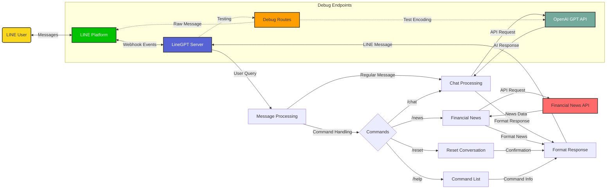

## 🔄 LineGPT Workflow

The following diagram illustrates the architecture and data flow of the LineGPT application:

This diagram shows how user messages flow through the LINE platform to the LineGPT server, where they are processed based on command type, then routed to appropriate services (OpenAI API or Financial News API), and finally formatted and sent back to the user through LINE. 